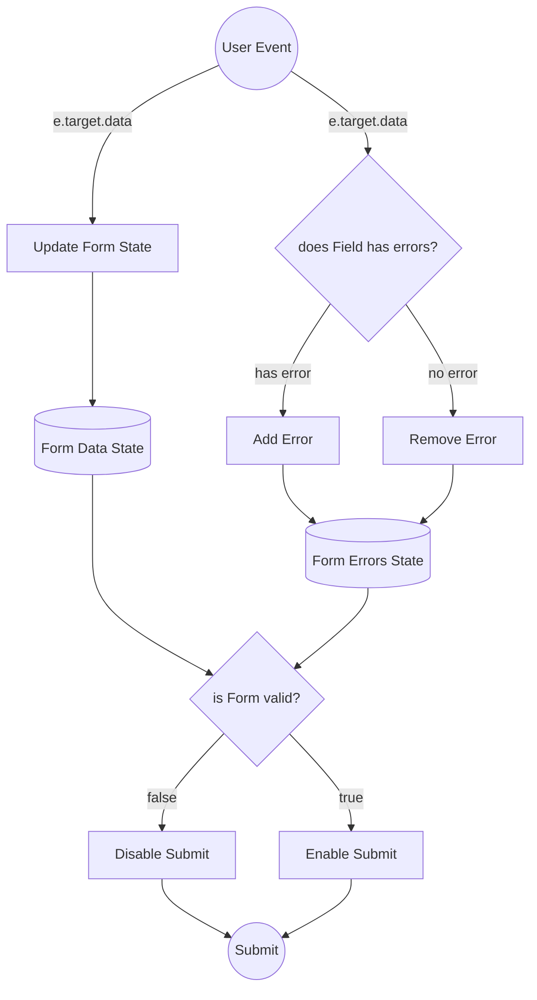

# Sprint Challenge: _Teknolojik Yemekler - SPA_

## Proje Açıklaması

Bu Single Page Application (SPA) projesi, geçmiş sprint boyunca öğrenilen kavramları ve teknikleri uygulamana ve bunları somut bir projede kullanmanı sağlayacak. Bu sprintte **tek sayfa uygulamalarını** (SPA) keşfettin. Sprint boyunca, **routing, formlar, ve cypress testlerini** öğrendin. Challenge skorun, bu sprint boyunca işlenen materyali kullanarak bağımsız çalışma yapabilme yeteneğinin bir göstergesi olacak. Bu projeyi de ödevlerdeki gibi tek başına yapacaksın.

S8 içinde de Workintech eğitmenlerine, adeta bir teknik mülakattaymış gibi, bu projeyi sunmanı istiyoruz.

- Bu sunumda, _1 dk_ içerisinde, CSS'e döktüğün arayüz; 3dk içinde geliştirdiğin React veri akışını anlatacaksın. İlk önce arayüzde nasıl bir kullanıcı deneyimi sunduğunu kısaca özetleyip, sonra altta kodların nasıl çalıştığını, nasıl bir veri akışı kurduğunu, açık bir şekilde ifade edebilmelisin.

> Kısaca: 4 dk içinde, önce arayüzü anlatıp, sonra kodun nasıl
> çalıştığını ifade edebilmelisin. Zaman kullanımı ve sunum tekniğin de değerlendirme kriterlerinde yer alıyor. Öncesinde, kendini videoya çekerek, sunum pratiği yapabilirsin.

## Önemli Notlar

- Her aşamada, tasarımı birebir uygulamaya çalışmalısın. Mobil versiyonu için Figma'ya bakabilirsin.
- Önce İterasyon 1'i tamamlayıp, sonra İterasyon 2'ye geçmelisin. Proje akışı minimum zamanda, React bilgini pekiştirebilmen için tasarlandı. Plandan çıktıkça asıl önemli olan işten uzaklaşıyor olabilirsin. O yüzden ek bir şey yapma isteği gelirse not alıp, proje bitince dönmelisin.
- Görevleri yetiştirmek için, MUTLAKA tasarımların listelendiği sırayla ilerle. Proje planından şaşma. Önceki task yetişmeden sonrakine geçtiysen ve eksik kalırsa puanın kırılabilir.
- Metinler ve form alanı başlıklarını kendi istediğin gibi güncelleyebilirsin. Yine de kesinlikle **renkler ve yerleşimde** değişiklik istemiyoruz.
- Sunumdan sonra dilersen sonrasında kendi portföyüne eklemeden önce için özelleştirebilirsin.
- (IT2) Sayfalar arası veri taşırken, (sipariş formundan, sonuş sayfasına), router veya başka bir global state management aracı kullanmadan, sadece [Prop-Lifting](https://react.dev/learn/sharing-state-between-components) tekniğiyle, projenizi geliştirmenizi bekliyoruz.

Not\* Bu dökümanın en sonunda da, sunumda seni değerlendireceğimiz başlıkları da bulabilirsin.

### Temsili Veri Akış Diagramları

#### Routes

```mermaid
graph LR
A((Anasayfa)) -->B([Sipariş Ver Butonu]) --> C[Sipariş Formu] -->Z((Sipariş Onayı))
```



#### Sipariş Formu Veri Akışı



## Talimatlar

Bu sprint challenge'ında, bilgisayar başında karnı acıkan yazılımcılara yiyecek getirmek için tasarlanmış bir web sitesi **Teknolojik Yemekler**' markasına, _Anasayfa_, _Sipariş Formu_ ve _Sipariş Alındı_ sayfası oluşturarak bu konulardaki ustalığınızı göstereceksin.  
Proje iki zorluk aşamalı,

1.  **İterasyon 1**: ilk önce asgari yeterli ürün (IT1-Minimum Viable Product) aşamasına getirmeyi hedeflemelisin.
2.  **Iterasyon 2**: İleri düzey görevlere eadece ama sadece, tasarımdaki IT1 kilometre taşına geldikten sonra başlamalısın. Buradaki gelişmiş görsel ve teknik problemleri çözmeyi IT1 sonrasında, aşağıda belirtilen sırada çözerek ilerlemelisin.
3.  Projenin iki aşamasının da gerekli görselleri proje klasöründe var. Ayrıca [**Figma Formatında**](https://www.figma.com/design/q0xPW5uCel3rdzFgpjR9lt/S8-Pizza-React-Challange-v2.1) formatındaki tasarıma bu adresten erişebilirsiniz.

## Aşama 1: Proje Kurulumu ve İterasyon 1

### Görev 1: Proje Kurulumu

- [ ] 1. **Create Repo From Template & Clone:**

  - Sağ üstteki yeşil "Use this template" butonu ile, bir kopya oluşturun. işlemi tamamlandıktan sonra, kendi GitHub hesabınızda yer alan depo bağlantısını kopyalayın.
  - VS Code'u açın ve terminali başlatın. Aşağıdaki komutu kullanarak depoyu bilgisayarınıza klonlayın:
    ```sh
    git clone <Yeni-Repo-URL'niz>
    ```
  - Örnek:
    ```sh
    git clone https://github.com/sizin-hesabiniz/fsweb-s8-challenge-pizza
    ```

2. **VS Code'da Geliştirmeye Başlamak:**
   - VS Code'u açın ve `File -> Open Folder` seçeneğiyle projeyi açın.

- Terminalde aşağıdaki komutları sırasıyla çalıştırarak proje bağımlılıklarını yükleyin ve projeyi başlatın:

  ```sh
  npm install
  npm run dev
  ```

- [ ] Yeni reponuzu bilgisayarınıza klonlayın

3. **Geliştirmeye Başlayın** 🤓 👩‍💻 🧑‍💻

- [ ] Main branch üzerinde çalışın
- [ ] Comitinizi pushlayın: `git push origin main`
- [ ] Farklı paketler kullanmaya çalışın.
  - `axios`
  - `react-strap`
  - `toastify`
  - `tailwindcss` (düz css oturduysa)
  - `cypress.io` v.b.

### Görev 2: Iterasyon 1 - (IT1) Proje Planını, UI Tasarımı ve Diğer Tasarım Öğelerini İncelemek

Zamanı verimli kullanmak için aşağıdaki sırayla geliştirme yapmanı tavsiye ediyoruz. Mobil ekranlar için Figma dosyasına da bakabilirsin.

1.  [Sipariş Formu](./sample-interfaces/iteration-1/OrderPizza.png)
2.  [Anasayfa](./sample-interfaces/iteration-1/Home.png)
3.  [Sipariş Onayı](./sample-interfaces/iteration-1/Success.png)

#### Renk Kodları

1. Sarı #FDC913
2. Açık Gri: #5F5F5F
3. Koyu Gri #292929
4. Kırmızı #CE2829
5. Bej: #FAF7F2

#### Tasarımda Kullanılan Fontlar

Logo proje klasöründe SVG olarak yüklü

- [Roboto Condensed](https://fonts.google.com/specimen/Roboto+Condensed)
- [Barlow](https://fonts.google.com/specimen/Barlow)
- [Quattrocento](https://fonts.google.com/specimen/Quattrocento)
- [Satisfy](https://fonts.google.com/specimen/Satisfy)

### Görev 3: IT1 Proje Gereklilikleri

IT1 aşamasına getirdiğiniz (minimum viable product), aşağıdaki gereksinimlerin hepsini sağlamalıdır.

- [ ] Hero alanındaki buton ile forma linklenen bir anasayfa.
- [ ] Bir sipariş formu
- [ ] En az 3 karakter gerektiren bir isim inputu. (İsim alanı tasarımda yok olabilir. Form'da notlar alanının üzerine ekleyebilirsin)
- [ ] Malzemeler için bir çoklu seçim - en az 4 adet ve en fazla 10 adet seçim yapılmalı (Tasarımda yine eksik gösterilmiş)
- [ ] Pizza boyutunun seçilebileceği bir radio
- [ ] Notlar için ek bir text area
- [ ] "Sipariş Ver" butonuna tıklandığında, sanki bir sunucuya veri gönderip, yanıt almış gibi davranmalı. Formda eksik bilgi veya hata varsa form disabled olmalı. (hem html hem submit fonksiyonundan gönderim engellenmeli)
- [ ] Submit edince, Axios ile API request sonrası console'a gelen yanıtı basmalısın. [https://reqres.in/api/pizza](https://reqres.in/api/pizza) ücretsiz bir mock api servisine, `axios` ile POST ile kendi datanızı attığınızda, size sanki veritabanına kaydedilmiş gibi id ve tarih ekleyip aynı veriyi geri döner. (SONRASINDA GET ATMIYORUZ)
- [ ] Bu yanıtı gelen response'u, sipariş özeti console'a yazmalı.

Not - Form'un payloadu, veri **örnek olarak** şu şekilde olabilir. **Kendiniz de bu yapıyı değiştirebilirsiniz.**

```
{
    isim: string,
    boyut: string,
    malzemeler: [malzeme1, malzeme2, malzeme3, ...]
    özel: string,
	(gerekli diğer alanlar)
}
```

veya

```
{
    isim: string,
    boyut: string,
    malzeme1: bool,
    malzeme2: bool,
    m...
    özel: string,
	(gerekli diğer alanlar)
}
```

#### Görev 4: IT1'i Test Etme

Çözümünde en iyi uygulamaları (best practices) izlemeniz, temiz ve profesyonel bir sonuç üretmen önemlidir. Cypress'le projenize şu testleri eklenmelidir:

- [ ] inputa bir metin giren test
- [ ] birden fazla malzeme seçilebilen bir test
- [ ] formu gönderen bir test

Cypress kurulumu için `npm install cypress --save-dev` komutunu gir ve `npx cypress open` yaz. Bu, "Cypress 10'a Hoş Geldiniz!" başlığı ve altında "Cypress 10'a Devam Et" yazan buton içeren bir diyalog açacaktır. Bu butona tıkla, ardından bir sonraki ekranın en altına git ve arka arkaya üç geçiş butonuna tıkla (birini tıkladıktan sonra sonraki bölüm genişleyecek ve bir sonraki geçiş seçimini tıklamana izin verecek). Bir sonraki ekranda 'e2e''yi seç ve bir sonraki ekranda da 'Scaffold Example Specs' seçeneğini seçip, ardından istediğin bir tarayıcı ile 'E2E Testini Başlat' butonuna basarak, testleri çalıştırabilirsin.
Tarayıcı açıldıktan sonra da, VSCode'da yeni oluşturduğun cypress klasöründe, e2e klasörüne git ve `pizza.cy.js` adlı yeni bir dosya oluştur. Artık testlerini yazmaya hazırsın! (Dosya isminde ".cy" olduğundan emin ol, aksi takdirde Cypress testlerini bulamaz!)

## Aşama 2: Iterasyon 2 - (IT2)

### Görev 2: IT2 UI Tasarımı ve React JS Geliştirmeleri

Zamanı verimli kullanmak için aşağıdaki sırayla geliştirme yapmanı tavsiye ediyoruz.

1.  [Sipariş Onayı](./sample-interfaces/iteration-2/Success.png)
2.  [Anasayfa](./sample-interfaces/iteration-2/Home.png)
3.  [Sipariş Formu](./sample-interfaces/iteration-2/OrderPizza.png)

### Görev 3: IT2 Proje Gereklilikleri

IT1'i bitirdikten sonra çalışmanı daha da ileri götürebilirsin. Buradaki hedefler, bu modülde öğrendiklerinizin dışında şeyler de olabilir. Yine de IT1'de bitirdiğiniz yapı üzerine inşa edilecek. Kendine bunları yapmak için mutlaka zaman tanı, sınırlarını zorla ve aşağıdaki hedeflere ulaşıp ulaşamayacağına bak:

- [ ] Tasarım güncellemesi: **Sipariş** sayfasında, sipariş özetini görüntüle.
  - [ ] Diğer sayfaya veriyi, useState hookunu, state lifting yaparak aktarmalısın. Başka bir paket ya da teknik kulllanılmamalı.
  - [ ] Axios yanıtını sonraki onay sayfasında göstermelisin.
  - [ ] Sipariş POST edilirken bir ağ hatası olasılığı için kullanıcıya geribildirim verebilmelisin (örnek: İnternet'e bağlanılamadı)
- [ ] Tasarım Güncellemesi: **Anasayfa** çok daha çeşitli tasarım öğeleriyle zenginleştir.
- [ ] Tasarım Güncellemesi: **Sipariş** Form elemanlarını (inputlar), özel renk ve tasarım diline göre güncelle
- [ ] Cypressle daha çok test yaz.

İpucu: Özelleştirilmiş Checkbox ve Radio için [W3 örneğine](https://www.w3schools.com/howto/howto_css_custom_checkbox.asp) bakabilirsiniz.
İpucu: Sayfalar arası veri taşırken, (sipariş formundan, sonuş sayfasına), router veya başka bir global state management aracı kullanmadan, sadece [Prop-Lifting](https://react.dev/learn/sharing-state-between-components) tekniğiyle, projenizi geliştirmenizi bekliyoruz.

# Notlandırma Kriterleri

## 1. IT1: Görseldeki bir tasarımı anlamlı bir HTML yapısı ve doğru semantik tagler kullanarak, hizalamalara ve CSS özelliklerine dikkat ederek koda dökebilir.

- **1 Gereksinimlerin Altında:**

  - Temel HTML elementlerini kullanır ancak semantik taglerden yararlanmada zayıftır (örn. her yerde `div` kullanımı).
  - Sayfa yapısında anlamsal hiyerarşi ve erişilebilirlik gözetmez.
  - Hizalamalar ve CSS özellikleri konusunda dikkatsizlikler gösterir; tasarımın genel görünümü istenilen düzeyde değildir.
  - Kodun okunabilirliği ve yeniden kullanılabilirliği düşüktür.

- **2 Gereklilikleri Karşılıyor:**

  - HTML5 semantik taglerini (örn. `header`, `footer`, `nav`, `section`) uygun yerlerde kullanır.
  - Sayfanın genel yapısını anlamlı bir şekilde oluşturur ve erişilebilirliği dikkate alır.
  - CSS ile düzgün hizalamalar yapar ve tasarımın genel görünümüne uygun özellikler seçer.
  - Kodun okunabilirliği ve yeniden kullanılabilirliği iyi düzeydedir.

- **3 Gereksinimleri Aşıyor:**
  - Semantik HTML kullanımında mükemmel bir seviyededir ve sayfanın yapısını, SEO ve erişilebilirliği maksimize edecek şekilde düzenler. (WCAG 2.1) Tab tuşuna basarak tüm sayfada gezilebilir durumdadır. Ek olarak interaktif elemanlarda, fonksiyonuna uygun "aria-label" bulunmaktadır.
  - CSS Flexbox hatta Grid gibi modern CSS yöntemlerini etkili bir şekilde kullanarak, tasarımdaki hizalamaları ve düzeni hassas bir şekilde uygular.
  - CSS özelliklerini (örn. geçişler, animasyonlar) kullanarak kullanıcı deneyimini zenginleştirir ve tasarımın estetik değerini artırır.
  - Kod, yüksek düzeyde optimize edilmiş, okunabilir ve yeniden kullanılabilir olup, en iyi uygulamaları (best practices) takip eder.

## 2. IT2: Görseldeki bir tasarımı anlamlı bir HTML yapısı ve doğru semantik tagler kullanarak, hizalamalara ve CSS özelliklerine dikkat ederek koda dökebilir.

- **1 Gereksinimlerin Altında:**

  - Aday IT2 tasarıma geçememiş veya yine yalnızca temel HTML tag'lerini kullanmış ve semantik tag'lardan yeterince faydalanmamış. İleri düzey özellikler veya daha karmaşık yapısal elementler göz ardı edilmiş.
  - CSS kullanımı basit ve yüzeyel. Tasarım detaylarına ve hizalamalara dikkat edilmemiş. İleri CSS özellikleri veya responsive tasarım teknikleri etkili bir şekilde kullanılmamış.

- **2 Gereksinimleri Karşılıyor:**

  - CSS kullanımı, tasarımın estetik ve fonksiyonel gerekliliklerini karşılar düzeyde. Tasarım detaylarına dikkat edilmiş, hizalama ve responsive tasarım temel düzeyde uygulanmış.
  - Aday, anlamlı bir HTML yapısı kullanarak içeriği doğru semantik tag'lar ile yapılandırmış. İçerik net bir şekilde bölümlere ayrılmış ve sayfa mantıklı bir akışa sahip.

- **3 Gereksinimleri Aşıyor:**
  - Aday, semantik anlamda zengin ve erişilebilir bir HTML yapısı oluşturmuş. Ek HTML5 özellikleri, ARIA rolleri kullanılarak sayfa hem insanlar hem de arama motorları için optimize edilmiş.
  - Aday, ileri düzey CSS teknikleri ve selectorler kullanarak detaylı ve karmaşık tasarım özelliklerini başarıyla kodlamış. CSS Grid veya Flexbox gibi modern layout sistemleri, form eleman özelliştirmeleri, animasyonlar, ve pseudo-elementler gibi gelişmiş özellikler etkili bir şekilde kullanılmış. Sayfa mükemmel bir şekilde responsive ve interaktif özelliklere sahip.

## 3. IT2: tasarımları uyarlayabilir ve yaptığı sayfayı responsive hale getirebilir.

- **1 Gereksinimlerin Altında:**

  - Sayfa yapısında ve kodun genel düzeninde anlamsal bütünlük ve erişilebilirlik unsurları yetersizdir.
  - CSS ile yapılan hizalamalar ve tasarım uygulamaları yüzeyseldir, detaylara ve tasarımın inceliklerine yeterince önem verilmez.
  - Kod tekrarı yaygındır, modülerlik ve yeniden kullanılabilirlik düşük düzeydedir.

- **2 Gereklilikleri Karşılıyor:**

  - Semantik HTML tagleri (örn. `article`, `aside`, `main`) etkin bir şekilde kullanılarak içerik anlamlandırılır ve yapılandırılır.
  - Erişilebilirlik standartlarına uygun bir şekilde sayfa yapısı kurulur ve klavye erişilebilirliği gibi unsurlar gözetilir.
  - CSS ile detaylı hizalamalar ve tasarım özellikleri dikkatli bir şekilde uygulanır; responsive tasarım prensipleri benimsenir.
  - Kodun okunabilirliği ve modüler yapısı iyi bir seviyededir.

- **3 Gereksinimleri Aşıyor:**
  - HTML ve CSS kullanımında derin bir anlayış sergilenir; semantik yapı mükemmel bir şekilde kurulur ve her elementin kullanım amacı açıkça belirlenir.
  - Modern CSS teknikleri (örn. CSS Grid, Flexbox) ve ileri düzey özellikler (örn. custom properties, animations) ustalıkla kullanılarak zengin ve dinamik kullanıcı arayüzleri oluşturulur.
  - Sayfa, tüm cihaz ve ekran boyutlarında mükemmel bir şekilde çalışacak şekilde tasarlanmıştır; yüksek performans ve erişilebilirlik için ileri düzey optimizasyonlar yapılır.
  - Kod, en iyi uygulamaları yansıtır, son derece modüler ve yeniden kullanılabilir yapıdadır; kod kalitesi ve sürdürülebilirlik açısından örnek teşkil eder.

## 4. Form elemanlarını ilgili etiketleriyle eşleştirebilir. Checkbox ve radiobutton gibi form semantiklerini doğru bir şekilde anlar ve uygular.

- **1 Gereksinimlerin Altında:**

  - Form elemanlarını ve etiketlerini temel düzeyde eşleştirir, ancak yaygın hatalar yapar (örn. `label` ile ilgili `input` elemanlarını doğru şekilde ilişkilendiremez).
  - Checkbox ve radiobutton kullanımında semantik hatalar yapar, kullanıcı arayüzünde kafa karışıklığına yol açabilir.
  - Controlled form elemanlarının event flow’u (örn. `onChange`, `onSubmit` gibi event handler’lar) yanlış veya eksik uygulanmıştır.

- **2 Gereklilikleri Karşılıyor:**

  - Form elemanları ile ilgili etiketleri doğru şekilde eşleştirir ve form elemanlarının kullanım amacını anlar.
  - Checkbox ve radiobutton gibi form elemanlarını doğru bir şekilde kullanır ve semantiklerini anlar; kullanıcıya net bir deneyim sunar.
  - Controlled form elemanlarını yönetir ve temel event handler’ları (örn. `onChange`, `onSubmit`) etkin bir şekilde kullanır. Formun doğru bir şekilde gönderilmesini ve kullanıcı girdisinin yönetilmesini sağlar.

- **3 Gereksinimleri Aşıyor:**
  - Form elemanları ve etiketleri arasında mükemmel bir eşleştirme yapar; `label` for ve `input` id ilişkilendirmesini ustalıkla kullanır.
  - Gelişmiş form semantiklerini anlar ve uygular, özellikle checkbox ve radiobutton gruplarını anlamlandırma ve kullanıcı deneyimini iyileştirme konusunda üstün bir yaklaşım sergiler. Farklı tiplerdeki alanları ortak event handlerlar ile yönetebilir.
  - Controlled form elemanları ile ilgili event flow’u ileri düzeyde yönetir; form verisini etkin bir şekilde toplar ve işler. `useState` ve `useEffect` gibi React hook’larını kullanarak form durumunu dinamik ve etkili bir şekilde yönetir.

## 5. Kodu componentlere bölebilir, bu componentları map metodu ile kullanabilir.

- **1 Gereksinimlerin Altında:**

  - Kodu mantıksal componentlere ayırma konusunda yetersiz kalır; kod tekrarı yaygındır ve component yapısını etkili bir şekilde kullanamaz.
  - `map` metodu kullanımında temel anlayışa sahiptir ancak bu yöntemi componentlerle etkili bir şekilde birleştiremez. Örneğin, listeleri render etmede hatalar yapar veya `key` prop'unun önemini göz ardı eder.
  - Componentler arası veri akışını ve prop kullanımını anlamada ve uygulamada eksiklikler gösterir.

- **2 Gereklilikleri Karşılıyor:**

  - Kodu anlamlı ve tekrarı minimize edecek şekilde componentlere ayırır. Temel component yapısını ve yeniden kullanılabilirliğini anlar ve uygular.
  - `map` metodu ile listeleri veya veri koleksiyonlarını etkili bir şekilde render edebilir; her eleman için benzersiz bir `key` prop sağlayarak performansı ve güncelleme davranışını optimize eder.
  - Componentler arasında veri akışını (props ve event handling) temel düzeyde yönetebilir ve component hiyerarşisinde veri iletimini sağlayabilir.

- **3 Gereksinimleri Aşıyor:**
  - Kodu yüksek derecede modüler componentlere ayırır ve her birinin yeniden kullanılabilirliğini, test edilebilirliğini ve bakım kolaylığını maksimize eder.
  - `map` metodu ile karmaşık ya da basit bütün veri yapılarını ve listeleri ustalıkla render eder; dinamik içeriği yönetmede ve güncellemelerde yüksek performans ve kullanıcı deneyimi sağlar.
  - Componentler arası veri akışını ve durum yönetimini (state management) sorunsuz düzeyde yönetebilir.

## 6. Veri akışını ve event handlerlar ile veri yönetimini bilir ve formları kullanırken veri doğrulaması yapabilir.

- **1 Gereksinimlerin Altında:**

  - Basit event handler kullanımlarını bilir ancak karmaşık veri akışlarını yönetmede yetersiz kalır.
  - Formlarda veri doğrulaması yapmamıştır ya da çoğunu eksik veya hatalı yapar.
  - Veri yönetimi ve event handlerlar arasındaki ilişkiyi anlamada ve bunları etkili bir şekilde entegre etmede zorlanır.
  - Hata yönetimi ve kullanıcıya geribildirim sağlama konularında eksiklikler gösterir.

- **2 Gereklilikleri Karşılıyor:**

  - Çeşitli event handlerları kullanarak veri akışını yönetebilir ve kullanıcı etkileşimlerine dinamik yanıtlar üretebilir.
  - JavaScript ile yeterli form doğrulama tekniklerini uygular.
  - State yönetimi ve componentler arası veri iletimi konusunda temel prensipleri uygular.
  - Kullanıcı hatalarını yakalar ve kullanıcı dostu geribildirimler sağlar, form gönderimi sırasında kullanıcı deneyimini iyileştirir.

- **3 Gereksinimleri Aşıyor:**
  - Gelişmiş veri akışı yönetimi becerileri gösterir kod tekrarı yoktur.
  - Form verisi işleme, event handling ve state yönetimi konularında derin bir anlayış sergiler; temiz bir kode ve ve kullanıcı deneyimini optimize eder.
  - Hata yönetimi ve kullanıcıya geribildirim mekanizmalarında eksiksiz ilerler, uygulamanın sağlamlığını ve erişilebilirliğini artırır.

## 7. Pizza siparişi verilince, https://reqres.in/api/pizza adresine POST atarak, Axios request simülasyonu kurgulayabilir.

- **1 Gereksinimlerin Altında:**

  - Axios yoktur.
  - Hatalı veya eksik URL, yanlış payload yapısı gibi temel hatalar yapar.
  - Hata yakalama (`catch` bloğu) ve başarılı yanıt işleme (`then` bloğu) konularında eksiklikler gösterir.
  - HTTP request ve response yapısını anlamada ve uygulamada zorluk çeker.

- **2 Gereklilikleri Karşılıyor:**

  - Axios ile `reqres.in` adresine doğru endpoint'e POST request gönderimi yapabilir.
  - Sipariş verilerini (örneğin, pizza türü, adet) uygun payload yapısı ile gönderir.
  - Başarılı ve hatalı yanıtları işleyebilir; basit hata yönetimi ve kullanıcı geribildirimleri sağlar.
  - .then .catch veya promise tabanlı yaklaşımları kullanarak asenkron veri akışını yönetebilir.

- **3 Gereksinimleri Aşıyor:**
  - Gelişmiş Axios konfigürasyonları kullanarak, .catch içinde hata yakalayıp kullanıcıya göstermek gibi daha düzey özellikleri etkin bir şekilde uygular.
  - Karmaşık hata yönetimi stratejileri geliştirir; farklı HTTP durum kodlarına göre detaylı hata mesajları ve kullanıcı geribildirimleri üretir.

## 8.Genel olarak React JS hakkında iyi bir anlayışa sahiptir.

- **1 Gereksinimlerin Altında:**

  - React JS’nin temel kavramlarını (örn. state, props) anlamada zorluk çeker.
  - State kullanımı sınırlıdır ve state’i bileşenler arası verimli bir şekilde yönetme konusunda eksiklikler gösterir.
  - Parent-child bileşenler arası veri iletiminde ve callback fonksiyonlarının kullanımında hatalar yapar.
  - Event handler ve form validation işlemlerini doğru şekilde kurgulayamaz; kodda hatalı veya eksik uygulamalar bulunur.
  - React’te veri akışını (state ve props data flow), form işlemlerini ve routing’i etkili bir şekilde kullanmada yetersiz kalır.

- **2 Gereklilikleri Karşılıyor:**

  - React JS’nin temel konseptlerine (state, props, component lifecycle, event handling) hakimdir ve bunları uygulayabilir.
  - State ve props kullanımında yetkinlik gösterir; parent-child bileşenleri arasında veri ve callback fonksiyonları etkili bir şekilde iletir.
  - Event handler’ları ve form validation süreçlerini doğru ve etkili bir şekilde kurgular.
  - Veri akışını (state ve props data flow), form veri yönetimi, routing ve prop passing konularında temel ve orta düzeyde uygulamalar gerçekleştirebilir.

- **3 Gereksinimleri Aşıyor:**
  - React JS üzerinde derin bir anlayışa ve uygulama becerisine sahiptir; ileri düzey state yönetimi ve performans optimizasyonu tekniklerini uygular.
  - Bileşenler arası veri iletiminde ve callback fonksiyonlarında hatasız kullanır.
  - Kompleks event handling ve form validation işlemlerini mükemmel bir şekilde kurgular ve uygular.
  - React’te ileri düzey veri akışı, form işlemleri, routing, ve prop passing konularında üstün beceriler gösterir.

## 9. Formları da kapsayan en az üç anlamlı cypress testi yazabilir.

- **1 Gereksinimlerin Altında:**

  - Cypress testleri yazmada temel bilgi eksiktir.
  - Yazılan testler, uygulamanın önemli akışlarını veya fonksiyonlarını kapsamaz veya çok sınırlı kapsamdadır.
  - Testlerde sıkça hatalar yapar (örneğin, seçicileri yanlış kullanmak, yanlış assertion'lar yapmak).
  - Formlarla ilgili test senaryoları eksik veya yanlış uygulanmıştır, form elemanları ve etkileşimleri doğru test edilmez.

- **2 Gereklilikleri Karşılıyor:**

  - Uygulamanın temel işlevselliğini test eden en az üç anlamlı Cypress testi yazabilir.
  - Testler, uygulamanın önemli akışlarını kapsar ve form işlemleri dahil olmak üzere temel kullanıcı etkileşimlerini doğru bir şekilde test eder.
  - Test senaryoları, uygulamanın beklenen davranışlarını doğru bir şekilde yansıtır ve başarılı bir şekilde çalışır.
  - Rastgele seçilmiş testler, uygulamanın kritik bölümlerini kapsayacak şekilde stratejik olarak seçilmiştir.

- **3 Gereksinimleri Aşıyor:**
  - Bütün uygulama akışını, ilk sayfadan başlayarak kapsamlı bir şekilde test eden, form işlemleri de dahil olmak üzere ileri düzey Cypress testleri yazabilir.
  - Yazılan testler, uygulamanın tüm önemli senaryolarını ve edge case'leri kapsar, yüksek kapsamlılık ve derinlik gösterir.
  - Testler, uygulamanın kullanıcı arayüzü ve işlevselliği üzerinde detaylı kontrol sağlar; form validasyonları, form veri akışı ve dinamik içeriklerin doğrulaması gibi ileri senaryoları içerir.
  - Testler, best practice'leri takip eder, kod tekrarını minimize eder ve test süitinin okunabilirliğini ve sürdürülebilirliğini artırır.

## 10. Açık uçlu soru: ... için, müşteri sayfaya yeni bir öğe eklememizi ister.

#### a) Bu yeni öğeyi eklemek için hangi tip form öğesi kullanılmalıdır?

#### b) Bu yeni öğenin eklenmesi için adımlar nasıl olmalıdır?

- **1 Gereksinimlerin Altında:**
  - Yanlış eleman seçimi ve/veya çok tereddütle, destek alarak düşünerek yanıt verebilmiştir.
- **2 Gereklilikleri Karşılıyor:**

  - Doğru form elemanlarından birinin seçmiştir. Veri yönetiminde doğru akışı ve adımları eksiksiz ifade edebilmiştir.

- **3 Gereksinimleri Aşıyor:**
  - Doğru yanıta ek, en az bir başka çözüm ile de daha geniş perspektiftan yanıtlayabilme, ikisi arasındaki benzerlik ve uygulama farklarını karşılaştırabilmek.
